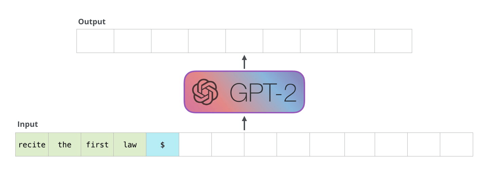
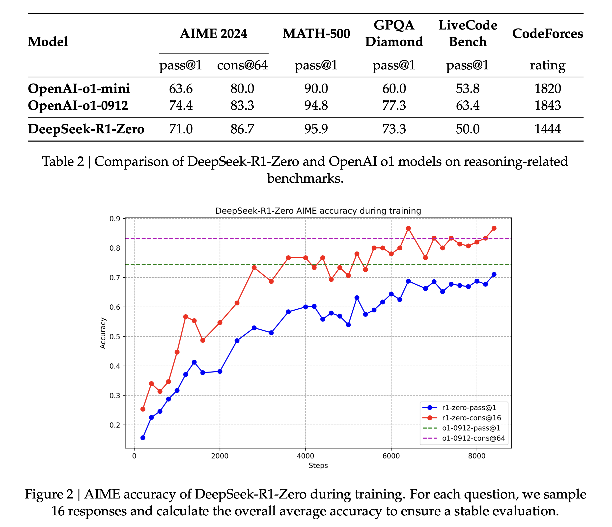

# Reinforcement Learning Algorithms in Deep Generative Model
- **Name**: Cheng Shen
- **Email**: shenchg126@gmail.com
- **Website**: [https://scaufish.github.io/](https://scaufish.github.io)

**RLHF has become a routine in LLM training these days**
> "To make our models safer, more helpful, and more aligned, we use an existing technique called reinforcement learning from human feedback (RLHF)⁠."
>
> Source: [OpenAI: Aligning language models to follow instructions, 01-2022](https://openai.com/index/instruction-following/?utm_source=chatgpt.com)

> "We apply preference modeling and reinforcement learning from human feedback (RLHF) to finetune language models to act as helpful and harmless assistants. We find this alignment training improves performance on almost all NLP evaluations, and is fully compatible with training for specialized skills such as python coding and summarization."
>
> Source: [Anthropic: Training a Helpful and Harmless Assistant with Reinforcement Learning from Human Feedback, 04-2022](https://www.anthropic.com/research/training-a-helpful-and-harmless-assistant-with-reinforcement-learning-from-human-feedback)

> "We introduce our first-generation reasoning models, DeepSeek-R1-Zero and DeepSeek-R1. DeepSeek-R1-Zero, a model trained via large-scale reinforcement learning (RL) without supervised fine-tuning (SFT) as a preliminary step, demonstrated remarkable performance on reasoning."
>
> Source: [DeepSeek: DeepSeek-R1: Incentivizing Reasoning Capability in LLMs via Reinforcement Learning, 01-2025](https://arxiv.org/abs/2501.12948)

[**and there've been interesting discussions**](https://x.com/karpathy/status/1821277264996352246)
<div align="center">
  
</div>


## Agenda
1. [Introduction to RL](#1-introduction-to-rl)
2. [Introduction to LLM](#2-introduction-to-llm)
3. [DeepSeek Training Paradigm](#3-deepseek-training-paradigm)
4. [Q&A](#4-qa)

## 1. Introduction to RL

<div align="center">
  
</div>

Take the classic, yet still impressive AlphaGo as an example [DeepMind: AlphaGo](https://deepmind.google/research/breakthroughs/alphago/)

### Basic Concepts
* **State** ($s \in \mathcal{S}$): The environment's current situation
    * In a game of Go: $s \in \{null, white, black\}^{361}$ is current state on the board.
* **Action** ($a \in \mathcal{A}$): The agent's possible moves
    * Assuming the agent plays black, $a \in \{0, ..., 360\}$
* **Reward** ($r \in \mathbb{R}$): Immediate feedback signal
    * Reward in Go could be quite sparse: -1/+1 depending on final loss/win
    * Other designs: reward for capturing opponent's stones?
    * AlphaGo: sparse reward depending only the final result

### Key Functions
* **Policy function** ($\pi(a|s)$): Probability distribution over actions given state
* **Value function** ($V^\pi(s) = \mathbb{E}_\pi[\sum_{t=0}^{\infty} \gamma^t r_t | s_0 = s]$): Expected cumulative reward starting from state $s$
    * The expected likelihood to win/lose given the current state and policy
* **Q-function** ($Q^\pi(s,a) = \mathbb{E}_\pi[\sum_{t=0}^{\infty} \gamma^t r_t | s_0 = s, a_0 = a]$): Expected return after taking action $a$ in state $s$
    * Note how **value function** and **Q-function** are related: 
    * $V^\pi(s) = \sum_{a \in \mathcal{A}} \pi(a|s) Q^\pi(s,a)$ 
    or 
    * $V^\pi(s) = \mathbb{E}_{a \sim \pi(\cdot|s)}[Q^\pi(s,a)]$
* **Reward function** ($r(s,a,s')$): Immediate reward for transition from $s$ to $s'$ via action $a$

### Objective
* Maximize expected cumulative reward: $J(\pi) = \mathbb{E}_\pi[\sum_{t=0}^{\infty} \gamma^t r_t]$
* Find optimal policy: $\pi^* = \arg\max_\pi J(\pi)$

### Approaches
* **Value-based**: Learn $V(s)$ or $Q(s,a)$ (e.g., Q-learning, DQN)
* **Policy-based**: Directly optimize $\pi(a|s)$ (e.g., REINFORCE, PPO)
* **Actor-Critic**: Combine both approaches (e.g. PPO on advantage)

### Policy Gradients and PPO
Policy gradient methods learn a parameterized policy that can select actions without consulting a value function.

The policy gradient theorem gives us the gradient of this objective ([Lilian's blog](https://lilianweng.github.io/posts/2018-04-08-policy-gradient/)):

$$\nabla J(\theta) = \mathbb{E}_{\tau \sim p_\theta(\tau)}[\sum_{t=0}^{T} \nabla_\theta \log \pi_\theta(a_t|s_t) \cdot A(s_t, a_t)]$$
Where:
- $\theta$ represents the policy parameters
- $\tau$ is a trajectory (sequence of states and actions)
- $p_\theta(\tau)$ is the probability of trajectory $\tau$ under policy $\pi_\theta$
- $A(s_t, a_t)$ is the advantage function at state $s_t$ and action $a_t$
- $\log \pi_\theta(a_t|s_t)$ is the log probability of taking action $a_t$ in state $s_t$ under policy $\pi_\theta$

Where $A(s_t, a_t)$ is the advantage function, which measures how much better taking action $a_t$ in state $s_t$ is compared to the average action according to the current policy:

$$A(s_t, a_t) = Q(s_t, a_t) - V(s_t)$$

Key algorithms and concepts:

**REINFORCE (Monte Carlo Policy Gradient)**
- The most basic policy gradient algorithm
- Updates policy parameters using the gradient: $\theta \leftarrow \theta + \alpha \nabla_\theta \log \pi_\theta(a_t|s_t) \cdot G_t$
- Where $G_t$ is the return from time step $t$
- High variance in gradient estimates due to randomness in trajectories

**Proximal Policy Optimization (PPO)**
- Addresses the problem of large policy updates destabilizing training
- Uses a clipped surrogate objective with advantage function:
  
  $$L^{CLIP}(\theta) = \mathbb{E}_t[\min(r_t(\theta) A_t, \text{clip}(r_t(\theta), 1-\epsilon, 1+\epsilon) A_t)]$$
  The full PPO loss function combines three components:
  
  $$L^{PPO}(\theta) = L^{CLIP}(\theta) - c_1 L^{VF}(\theta) + c_2 S[\pi_\theta](s)$$
  
  where:
  - $L^{CLIP}(\theta)$ is the clipped surrogate objective described above
  - $L^{VF}(\theta)$ is the value function loss, typically a squared-error loss:
    $$L^{VF}(\theta) = (V_\theta(s_t) - V_t^{target})^2$$
  - $S[\pi_\theta](s)$ is an entropy bonus to encourage exploration:
    $$S[\pi_\theta](s) = -\sum_a \pi_\theta(a|s) \log \pi_\theta(a|s)$$
  - $c_1$ and $c_2$ are coefficients that balance the importance of each term
  
  This combined objective encourages both policy improvement and accurate value estimation while maintaining sufficient exploration.
  
  where:
  - $r_t(\theta) = \frac{\pi_\theta(a_t|s_t)}{\pi_{\theta_{old}}(a_t|s_t)}$ is the probability ratio
  - $A_t$ is the advantage estimate at timestep $t$
  - The clipping prevents the ratio from moving too far from 1, limiting the policy update size
- More stable and sample-efficient than traditional policy gradient methods

**Comparisions**

Key advantages of policy gradient methods:
- Can learn stochastic policies, which may be optimal in partially observable environments
- Can handle continuous action spaces naturally
- Can learn policies with arbitrary action distributions
- More stable learning in many environments compared to value-based methods

Challenges:
- High variance in gradient estimates
- Sample inefficiency
- Sensitivity to hyperparameters
- Potential for premature convergence to suboptimal policies

### Try them out!
* [Gymnasium](https://gymnasium.farama.org)
* [Huggingface RL Algorighms](https://gymnasium.farama.org)
* ...

```
# python3.9, gym=0.26.2, stable_baselines3=2.6.0
import gym
from stable_baselines3 import PPO
from stable_baselines3.common.evaluation import evaluate_policy

# Create the CartPole environment
env = gym.make("CartPole-v1")

# Instantiate the PPO model with an MLP policy
model = PPO("MlpPolicy", env, verbose=1)

# Train the model for 10,000 timesteps
model.learn(total_timesteps=10000)

# Evaluate the trained model
mean_reward, std_reward = evaluate_policy(model, env, n_eval_episodes=10)
print(f"Mean reward: {mean_reward:.2f} +/- {std_reward:.2f}")

# Save the trained model
model.save("ppo_CartPole")

# To demonstrate loading, delete the existing model and load it back
del model
model = PPO.load("ppo_CartPole", env=env)

# Enjoy the trained agent
obs, _ = env.reset()
for _ in range(1000):
    action, _ = model.predict(obs, deterministic=True)
    obs, reward, done, truncated, info = env.step(action)
    env.render()
    if done or truncated:
        obs, _ = env.reset()

env.close()
```

## 2. Introduction to LLM
### 2.1 Autoregressive generative model
Autoregressive language models generate text by predicting one token at a time, with each prediction conditioned on all previously generated tokens. This sequential generation process can be formalized as:

$$p(x) = \prod_{t=1}^{T} p(x_t | x_{<t})$$

Where:
- $p(x)$ is the probability of generating the entire sequence $x$
- $x_t$ is the token at position $t$
- $x_{<t}$ represents all tokens before position $t$
- $T$ is the total sequence length
- Note how this is analogous to policy function in RL: $\pi(a|s)$

Key principles:
- **Conditional probability**: Each token is predicted based on the context of all previous tokens
- **Maximum likelihood training**: Models are trained to maximize the log probability of predicting the correct next token
- **Teacher forcing**: During training, ground truth tokens are used as context regardless of the model's predictions
- **Attention mechanisms**: Modern autoregressive models like GPT use self-attention to capture dependencies between tokens at different positions
- **Causal masking**: To maintain the autoregressive property, attention is masked to prevent looking at future tokens

The training objective is typically to minimize the negative log-likelihood:

$$\mathcal{L}(\theta) = -\sum_{t=1}^{T} \log p_\theta(x_t | x_{<t})$$

Where $\theta$ represents the model parameters.

### 2.2 Transformer and Decoder-only model
<div align="center">
  
</div>

#### Generative Pretrained Transformer [visualization by Jay Alammar](https://jalammar.github.io/images/xlnet/gpt-2-autoregression-2.gif)
<div align="center">
  
</div>

### 2.3 RLHF in LLM
* Current LLM training usually contains following stages: pretraining, supervised fine-tuning (SFT), Reinforcement Learning with Human Feedback / Preference Optimization
* Used for alignment, and improvements where directly labeled data is hard to obtain.
* Human annotators are better at picking the better answer, than writing a good answer -- so is the reward model

<div align="center">
  
</div>

**with PPO (Proximal Policy Optimization)**
1. Collect outputs and human preferences on input $(x, y_1, y_2, b)$, where $b$ is the human selection. Initialize reward model $r$ as $\pi_{SFT}$, and initialize reference model $\pi_{ref}$ as $\pi_{SFT}$.
2. Train reward model $r$ based on human preference (Bradley-Terry Loss). $r$ is usually initialized with a LLM after SFT $\pi_{SFT}$.
3. Optimize policy $\pi$ over modified reward $R = r(x, y) + \beta \mathbf{D}_{KL}(\pi_\theta(y|x) | \pi_{ref}(y|x))$
4. Collect more human feedback on samples generated by $\pi_{ref}$, repeat step 2-3.

**Simplification with DPO (Direct Preference Optimization)**
* Proposed specifically for LLM RLHF stage.
* No need to train a separate reward model, as the reward model can be rewritten in the form with policy.
* Leverages offline generated samples and human labels.
$$\mathcal{L}_{\text{DPO}}(\pi_{\theta}; \pi_{\text{ref}}) 
= -\mathbb{E}_{(x,y_w,y_l) \sim \mathcal{D}} 
\left[ 
    \log \sigma\left(
        \beta \log \frac{\pi_{\theta}(y_w \mid x)}{\pi_{\text{ref}}(y_w \mid x)} 
        - \beta \log \frac{\pi_{\theta}(y_l \mid x)}{\pi_{\text{ref}}(y_l \mid x)}
    \right)
\right]
$$


## 3. DeepSeek Training Paradigm
### 3.1 DeepSeek-R1 and DeepSeek-R1-Zero [visualization by Harry Chan](https://x.com/SirrahChan/status/1881488738473357753)
<div align="center">
  
</div>

* DeepSeek-V3 Base: Trained on 14.8T tokens
    * Good old next-token prediction
    * Fill-in-Middle (FIM) strategy on 10% of data
* DeepSeek-V3: 
    * Supervised Fine-tuning (SFT): 1.5M instances of instruction
    * Reinforcement Leraning (GRPO)
* Reward model is more result-oriented 
    * Leverage rule-based reward for coding and math questions
    * Reward model trained with human feedback on non-reasoning tasks

### 3.2 GRPO
[GRPO Paper](https://arxiv.org/pdf/2402.03300)

Simplified loss function compared to PPO
<div align="center">
  
</div>


**PPO (simplified for gradient analysis)**
$$\mathcal{J}_{PPO}(\theta) = \mathbb{E}_{q \sim P_{sft}(Q),\, o \sim \pi_{\theta_{\text{old}}}(O \mid q)} \left[ \frac{1}{|o|} \sum_{t=1}^{|o|} \frac{\pi_{\theta}(o_t \mid q, o_{<t})}{\pi_{\theta_{\text{old}}}(o_t \mid q, o_{<t})} A_t \right]$$
$$\nabla_{\theta} \mathcal{J}_{PPO}(\theta) = \mathbb{E}_{q \sim P_{sft}(Q),\, o \sim \pi_{\theta_{\text{old}}}(O \mid q)} \left[ \frac{1}{|o|} \sum_{t=1}^{|o|} A_t \nabla_{\theta} \log \pi_{\theta}(o_t \mid q, o_{<t}) \right]$$

**DPO**
$$\mathcal{J}_{DPO}(\theta) 
= \mathbb{E}_{[q \sim P_{sft}(Q), o^{+}, o^{-} \sim \pi_{sft}(O|q)]} 
\log \sigma \left(
    \beta \frac{1}{|o^{+}|}\sum_{t=1}^{|o^{+}|} \log \frac{\pi_{\theta}(o^{+}_{t}|q,o^{+}_{<t})}{\pi_{\text{ref}}(o^{+}_{t}|q,o^{+}_{<t})}
    - \beta \frac{1}{|o^{-}|}\sum_{t=1}^{|o^{-}|} \log \frac{\pi_{\theta}(o^{-}_{t}|q,o^{-}_{<t})}{\pi_{\text{ref}}(o^{-}_{t}|q,o^{-}_{<t})}
\right)$$

$$\nabla_{\theta}\mathcal{J}_{DPO}(\theta) 
= \mathbb{E}_{[q \sim P_{sft}(Q), o^{+}, o^{-} \sim \pi_{sft}(O|q)]}
\left(
    \frac{1}{|o^{+}|}\sum_{t=1}^{|o^{+}|}GC_{DPO}(q,o,t)\nabla_{\theta}\log\pi_{\theta}(o^{+}_{t}|q,o^{+}_{<t}) \\
    -\frac{1}{|o^{-}|}\sum_{t=1}^{|o^{-}|}GC_{DPO}(q,o,t)\nabla_{\theta}\log\pi_{\theta}(o^{-}_{t}|q,o^{-}_{<t})
\right)$$
$$GC_{DPO}(q,o,t) 
= \sigma\left(
    \beta \log \frac{\pi_{\theta}(o^{-}_{t}|q,o^{-}_{<t})}{\pi_{\text{ref}}(o^{-}_{t}|q,o^{-}_{<t})}
    - \beta \log \frac{\pi_{\theta}(o^{+}_{t}|q,o^{+}_{<t})}{\pi_{\text{ref}}(o^{+}_{t}|q,o^{+}_{<t})}
\right)$$

**GRPO**
$$\mathcal{J}_{\text{GRPO}}(\theta) = $$
$$\mathbb{E}_{q \sim P_{sft}(Q),\, \{o_i\}_{i=1}^G \sim \pi_{\theta_{\text{old}}}(O \mid q)} \left[ 
\frac{1}{G} \sum_{i=1}^G \frac{1}{|o_i|} \sum_{t=1}^{|o_i|} 
\left( 
\frac{\pi_\theta(o_{i,t} \mid q, o_{i,<t})}{\pi_{\theta_{\text{old}}}(o_{i,t} \mid q, o_{i,<t})} \hat{A}_{i,t}
- \beta \left( \frac{\pi_{\text{ref}}(o_{i,t} \mid q, o_{i,<t})}{\pi_\theta(o_{i,t} \mid q, o_{i,<t})} - \log \frac{\pi_{\text{ref}}(o_{i,t} \mid q, o_{i,<t})}{\pi_\theta(o_{i,t} \mid q, o_{i,<t})} - 1 \right)
\right)
\right]$$

$$\nabla_{\theta} \mathcal{J}_{\text{GRPO}}(\theta) = $$
$$\mathbb{E}_{q \sim P_{sft}(Q),\, \{o_i\}_{i=1}^G \sim \pi_{\theta_{\text{old}}}(O \mid q)} \left[ 
\frac{1}{G} \sum_{i=1}^G \frac{1}{|o_i|} \sum_{t=1}^{|o_i|} 
\left( 
\hat{A}_{i,t} + \beta \left( \frac{\pi_{\text{ref}}(o_{i,t} \mid q, o_{i,<t})}{\pi_{\theta}(o_{i,t} \mid q, o_{i,<t})} - 1 \right)
\right) \nabla_{\theta} \log \pi_{\theta}(o_{i,t} \mid q, o_{i,<t}) 
\right]$$

### 3.3 RL for reasoning
* **Performance**
<div align="center">
  
</div>

* **Aha Moment, and longer thinking process**

* **Mixture of different languages** [Anthropic's research about the languages in LLM's head](https://www.anthropic.com/research/tracing-thoughts-language-model).
    * alignment (to enforce consistent language) results in a slight degradation in the model’s performance
 
* Observed reward hacking on neural reward model -- DeepSeek-R1-Zero is trained purely with rule-based reward

* **Failure with MCTS**
    * Inspired by AlphaGo
    * Echos the question -- what is a unit action in LLM, token? sequence? or block?

* Dislike of few-shot prompting

## 4. Q&A
